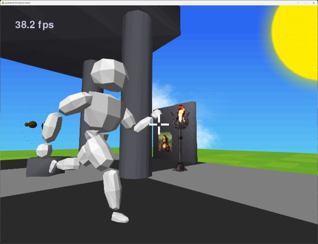

# pyrasterize

## Rasterizer for pygame without additional dependencies

The rasterizer relies on the speed of pygame's 2D polygon drawing functions to achieve acceptable performance.
As an alternative to per-pixel Gouraud shading and texturing that would be too slow an approximation is
available that simulates those effects by subdividing triangles to an adjustable degree.
The rasterizer ingests a hierarchical scene graph (Python dict) as the scene description.

## Demos

Back-face culling video https://imgur.com/gallery/6xwGUk4

Painter's algorithm video https://imgur.com/gallery/47Z6Vle

Scene graph video https://imgur.com/gallery/lGsBms1

FOV video https://imgur.com/gallery/xXC56Cl

Mouse selection video https://imgur.com/a/YxD0HCn

Shell game demo made with pygbag on itch.io https://pelicanicious.itch.io/pyrasterize-shellgame

Gouraud shading / draw modes demo video https://i.imgur.com/XC3njax.mp4

First person game-like multiple features demo: https://i.imgur.com/bsGH7YP.mp4 - on itch.io: https://pelicanicious.itch.io/pyrasterize-firstpersondemo

3D labyrinth first person demo: https://i.imgur.com/zLBnNwk.mp4 video - on itch.io: https://pelicanicious.itch.io/pyrasterize-labyrinth

Particles demo: https://i.imgur.com/WGhYuGs.mp4

Fast pseudo Gouraud implementation demo: https://www.reddit.com/r/pygame/comments/1347a71/a_pseudo_gouraud_shading_algorithm_for_software/

Animated meshes demo: https://i.imgur.com/w8k9R32.mp4
